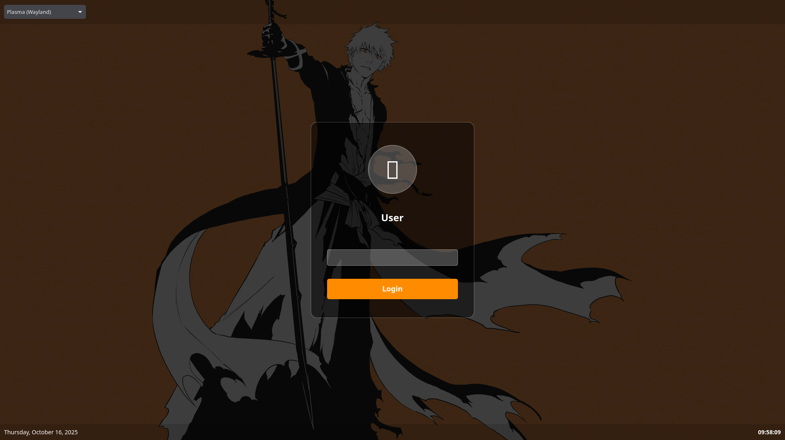

# Bleach SDDM Login Theme

A modern, Bleach-inspired SDDM login theme for KDE Plasma 6 with a sleek dark design.



## Features

- Modern dark design with translucent panels
- Session selection dropdown
- Power management buttons (suspend, reboot, shutdown)
- Real-time clock display
- Responsive layout
- Smooth animations and hover effects
- Customizable background image

## Requirements

- SDDM display manager
- Qt 6
- Qt5Compat.GraphicalEffects module
- KDE Plasma (recommended, but works with other DEs)

## Quick Installation

### Automatic Installation (Recommended)

```bash
# Clone the repository
git clone https://github.com/soskfishson/bleach-sddm-theme.git
cd bleach-sddm-theme

# Make the install script executable
chmod +x install.sh

# Run the installer
sudo ./install.sh
```

The installer will:
- ✅ Check dependencies
- ✅ Install theme files
- ✅ Configure user avatar (or at least try to)
- ✅ Update SDDM configuration
- ✅ Offer to test the theme

### Manual Installation

1. **Copy theme files:**
   ```bash
   sudo cp -r bleach_login /usr/share/sddm/themes/
   ```

2. **Set permissions:**
   ```bash
   sudo chmod -R 755 /usr/share/sddm/themes/bleach_login
   ```

3. **Configure SDDM:**
   ```bash
   sudo mkdir -p /etc/sddm.conf.d
   sudo nano /etc/sddm.conf.d/theme.conf
   ```
   
   Add:
   ```ini
   [Theme]
   Current=bleach_login
   ```

4. **Restart SDDM:**
   ```bash
   sudo systemctl restart sddm
   ```

## Customization

### Change Background Image

Edit `/usr/share/sddm/themes/bleach_login/theme.conf`:

```ini
[General]
background=/path/to/your/wallpaper.jpg
```

Or place your image as `background.jpg` in the theme directory.

### Set User Avatar (this may or may not work)

#### Method 1: Home Directory
```bash
cp /path/to/your/avatar.jpg ~/.face.icon
```

#### Method 2: AccountsService
```bash
sudo cp /path/to/your/avatar.jpg /var/lib/AccountsService/icons/$USER

# Create/edit user config
sudo nano /var/lib/AccountsService/users/$USER
```

Add:
```ini
[User]
Icon=/var/lib/AccountsService/icons/$USER
```

### Customize Colors

Edit `Main.qml` and modify the color values:

```qml
// Login container background
color: "#80000000"  // Semi-transparent black

// Login button
color: "#ff8c00"    // Orange

// Borders
border.color: "#40ffffff"  // Semi-transparent white
```

## Testing

Test the theme without restarting SDDM:

```bash
sddm-greeter-qt6 --test-mode --theme /usr/share/sddm/themes/bleach_login
```

## Troubleshooting

### Theme not loading

Check SDDM logs:
```bash
sudo journalctl -u sddm -b
```

### Avatar not displaying

Common issue, have no honest idea how to fix it :/

### Qt5Compat module missing

Install the required package:

- **Arch/Manjaro:**
  ```bash
  sudo pacman -S qt6-5compat
  ```

- **Ubuntu/Debian:**
  ```bash
  sudo apt install qt6-5compat-dev
  ```

- **Fedora:**
  ```bash
  sudo dnf install qt6-qt5compat
  ```

### Locale warnings

If you see locale warnings in logs, configure your locale:

```bash
sudo localectl set-locale LANG=en_US.UTF-8
```

## Uninstallation

### Using the script:
```bash
sudo ./install.sh uninstall
```

### Manual:
```bash
sudo rm -rf /usr/share/sddm/themes/bleach_login

sudo rm /etc/sddm.conf.d/theme.conf

sudo systemctl restart sddm
```

## Credits

- **Author:** Fishson
- **Inspired by:** Bleach anime series
- **Based on:** KDE Breeze SDDM theme

## License

This project is licensed under the **GNU General Public License v3.0 or later (GPL-3.0-or-later)**.

### Attribution

Portions of this theme are derived from the [KDE Breeze SDDM Theme](https://invent.kde.org/plasma/breeze):
- Copyright (C) 2016 David Edmundson <davidedmundson@kde.org>
- Licensed under LGPL-2.0-or-later

### Original Work
- Copyright (C) 2024 Fishson
- Licensed under GPL-3.0-or-later

See [LICENSE](LICENSE) for the full license text.

This program is distributed in the hope that it will be useful, but WITHOUT ANY WARRANTY; without even the implied warranty of MERCHANTABILITY or FITNESS FOR A PARTICULAR PURPOSE. See the GNU General Public License for more details.

## Contributing

Contributions are welcome! Please feel free to submit a Pull Request.

## Screenshots

### Login Screen


## Support

If you encounter any issues:
1. Check the [Troubleshooting](#troubleshooting) section
2. Review SDDM logs: `sudo journalctl -u sddm -b`
3. Open an issue on GitHub

## Changelog

### Version 1.0
- Initial release
- User avatar support(kinda)
- Session selection
- Power management
- Custom background
- Real-time clock

---
